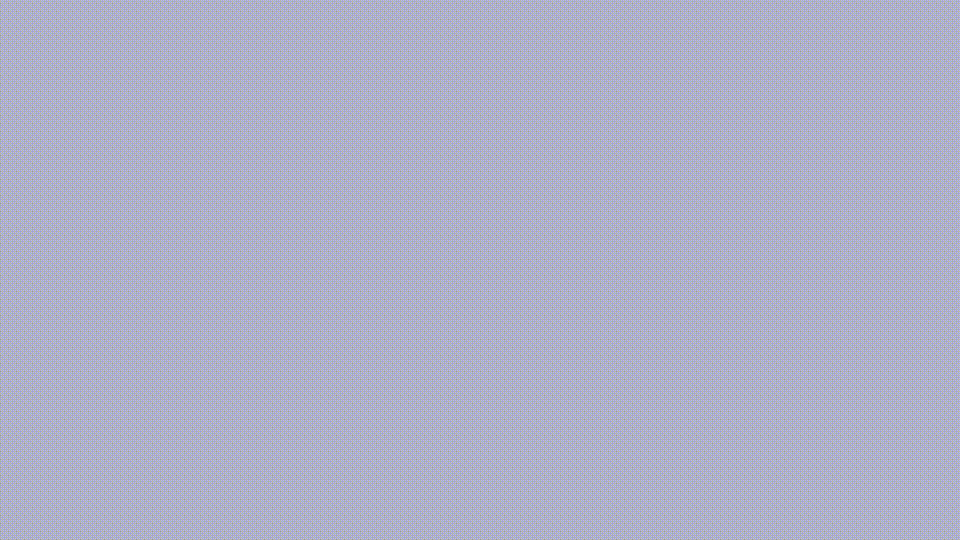

# OpenCat Gym
A gym reinforcement learning environment for OpenCat robots based on Stable-Baselines3 and PyBullet.

## Nybble version

## Bittle version

## Usage
Start training with train_nybble.py or train_bittle.py
To take a look at the pre-trained example, execute enjoy_nybble.py or enjoy_bittle.py.

## Links
For more information on the reinforcement training implementation: https://stable-baselines3.readthedocs.io/en/master/index.html
And for the simulation environment please refer to: https://pybullet.org/wordpress/
